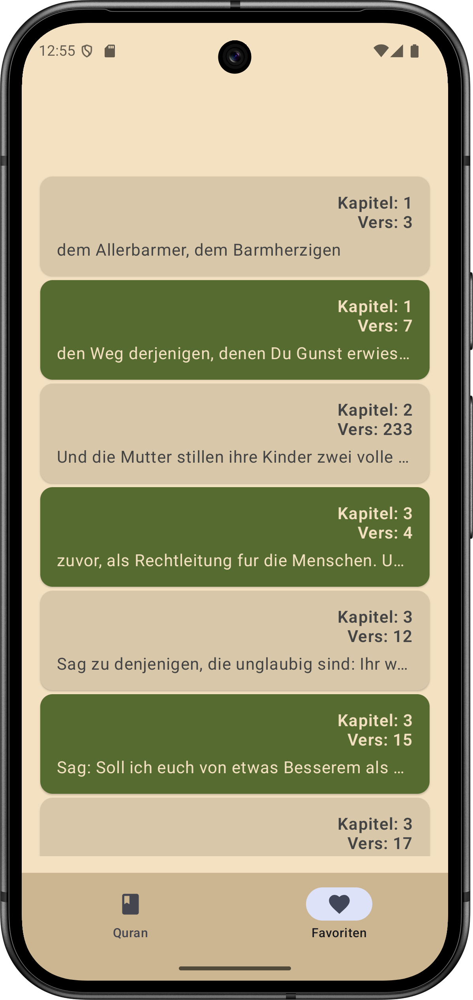

# Labbyk

**Der Koran in verschieden sprachen.**

Jederzeit kostenlos und offline in 90 verschiedenen Sprachen zum Rezitieren und Nachschlagen.

## Design

  
  
  
  

## Features
- [x] Die Daten werden lokal in der Room-Datenbank gespeichert.  
- [x] Keine Anmeldung erforderlich.  
- [x] Suche nach Kapiteln.  
- [x] Durch Klick auf den gewünschten Vers wird die Übersetzung auf Deutsch angezeigt.  
- [x] Gewünschte Verse favorisieren.  

## Technischer Aufbau

#### Projektaufbau
In diesem Projekt wurde die MVVM-Architektur angewendet, um die Trennung von View und Logik sicherzustellen. Die einzelnen Komponenten wie Views (inkl. SubViews), ViewModels, Models, Modifiers, Fonts, Manager, die API-Anbindung sowie Extensions wurden in separaten Ordnern strukturiert abgelegt.

Zur Sicherstellung eines einheitlichen Designs wurden die Farbdefinitionen zentral in den Assets hinterlegt.

#### Datenspeicherung  
Alle vom Nutzer eingegebenen Daten werden in der Room-Datenbank gespeichert.  

Die Entscheidung für Room basiert auf den folgenden Vorteilen:  

- **Lokale Speicherung:** Alle Daten werden direkt auf dem Gerät gespeichert, ohne eine Internetverbindung zu benötigen.  
- **Offline-Nutzung:** Die Anwendung kann vollständig offline genutzt werden, da keine Synchronisierung mit einem Server erforderlich ist.  
- **Performance:** Room bietet eine effiziente und optimierte Speicherung von Daten mit SQLite im Hintergrund.  
- **Flexibilität:** Die Datenbank kann an die spezifischen Anforderungen des Projekts angepasst und erweitert werden.  

#### API Calls  
In dieser App werden zwei verschiedene Quran-APIs verwendet: eine für den Koran im Original und eine zweite für die Übersetzungen in andere Sprachen. Der gesamte Inhalt wird in die Datenbank gespeichert.

## Ausblick  

- [ ] Audio-Wiedergabe von renommierten Rezitatoren  
- [ ] Lesezeichen-Funktion  
- [ ] Download-Funktion für Übersetzungen in der gewünschten Sprache  
- [ ] Einbeziehung der Koran-Exegese  
- [ ] Einbeziehung von Hadithen  
